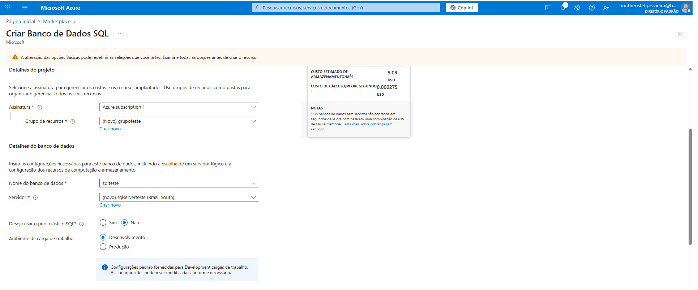
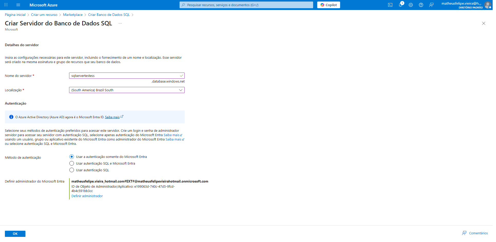
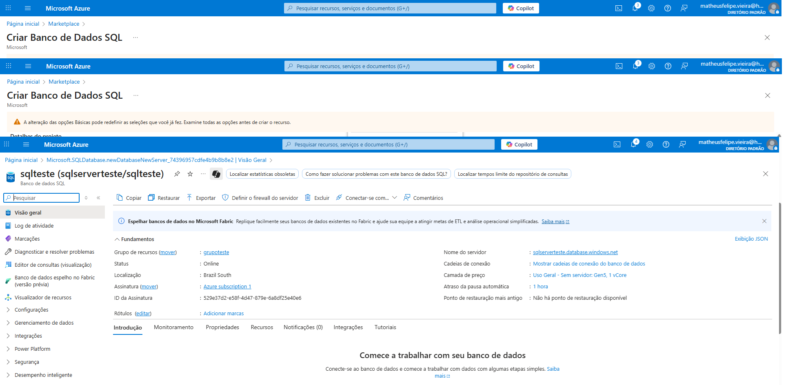

# 🛠️ Guia Prático: Criação de Banco de Dados SQL no Microsoft Azure

## 📌 Sobre o Projeto
Este repositório documenta o passo a passo da criação de uma **instância de Banco de Dados SQL** no Microsoft Azure, realizado como parte do desafio da [Digital Innovation One](https://www.dio.me/).  
O conteúdo reúne **resumos, anotações e dicas práticas** para auxiliar nos estudos e futuras implementações na nuvem.

---

## 🎯 Objetivos de Aprendizagem
- Aplicar os conceitos aprendidos sobre serviços de banco de dados na nuvem.
- Documentar processos técnicos de forma clara e acessível.
- Utilizar o GitHub como plataforma de compartilhamento de documentação técnica.

---

## ☁️ O que é o Azure SQL Database?
O **Azure SQL Database** é um serviço de banco de dados relacional totalmente gerenciado pela Microsoft. Ele oferece alta disponibilidade, segurança avançada e escalabilidade, permitindo que aplicações armazenem e processem dados sem a necessidade de gerenciar infraestrutura física.  

**Vantagens principais:**
- 📈 Escalabilidade sob demanda.
- 🔒 Segurança integrada e criptografia de dados.
- ♻️ Backups automáticos.
- 🌍 Acesso remoto e global.

---

## 📝 Passo a Passo da Criação

### 1️⃣ Acessar o Portal Azure
- Link: [https://portal.azure.com](https://portal.azure.com)
- Fazer login com sua conta Microsoft.

### 2️⃣ Criar um Banco de Dados SQL
- Clicar em **"Criar um recurso"**.
- Pesquisar por **"SQL Database"**.
- Selecionar e clicar em **"Criar"**.

### 3️⃣ Configurar o Banco
- **Assinatura**: Selecionar a disponível.
- **Grupo de Recursos**: Criar ou selecionar um existente.
- **Nome do Banco**: Escolher um nome único.
- **Servidor**: Criar um novo (definir nome, região, usuário admin e senha).
- **Ambiente de carga de trabalho**: Selecionar ("Desenvolvimento").
- **Redundância do armazenamento de backup**:Quando você faz backups, pode escolher como e onde eles serão armazenados para garantir que, em caso de falha ou desastre, você consiga restaurar seus dados. As opções de redundância definem quão resistente o backup é a falhas ou desastres regionai

### 4️⃣ Revisar e Criar
- Conferir todas as configurações.
- Clicar em **"Revisar + Criar"** e depois em **"Criar"**.

---

## 💡 Dicas Importantes
- ✅ Configure o **firewall do banco** para permitir acesso do seu IP.
- ✅ Sempre guarde usuário e senha em local seguro.
- ✅ Use **variáveis de ambiente** no seu código para proteger a Connection String.
- ✅ Para economizar, escolha a **camada gratuita ou básica** durante os testes.

---

## 📂 Estrutura do Repositório

/images  # Capturas de tela do processo

README.md  # Documentação principal

---
## 📷 Capturas de Tela

  
  
  

---

## 📚 Referências
- [Documentação Oficial do Azure SQL Database](https://learn.microsoft.com/azure/azure-sql/)
- [Microsoft Learn - Criar Banco de Dados SQL](https://learn.microsoft.com/azure/azure-sql/database/single-database-create-quickstart)

---

✍️ **Autor:** Matheus Felipe Vieira 
📅 **Data:** 14/08/2025

